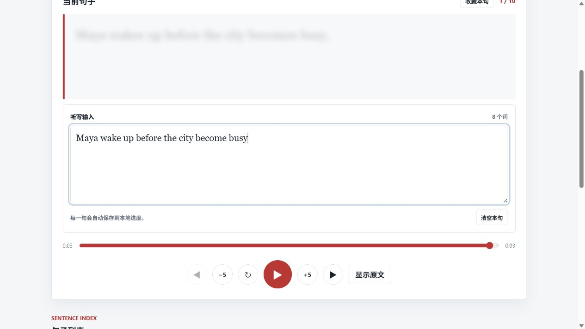
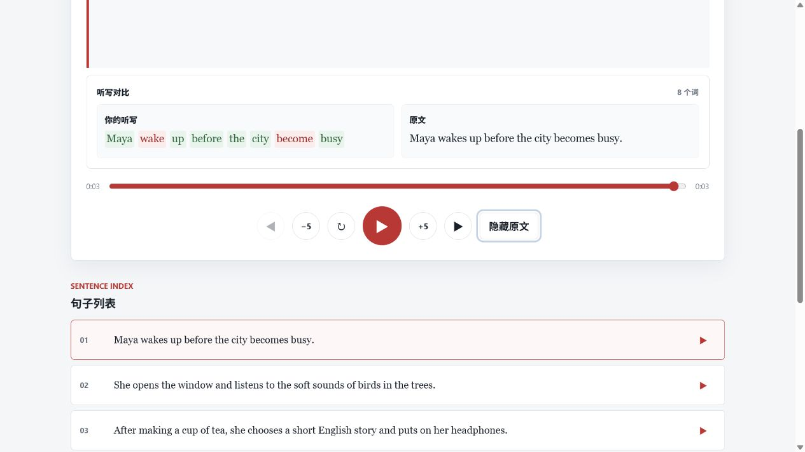

# English Listening Player

[**中文说明**](#中文说明) · [**English Instructions**](#english)

> ## 🎧 [打开在线 Demo / Open the Live Online Demo](https://lis-li.github.io/english-listening-player/)
>
> 4 篇原创听力文章，美式女声与男声，无需安装。
> Four original listening articles with American female and male voices. No installation required.

---

## 中文说明

这是一个在本地运行的英语听力练习网页。你可以导入英文文本或 `.docx` 文档，生成自然语音，逐句练习，记录笔记和学习进度。

### 在线 Demo

GitHub Pages 版本可以直接在现代浏览器中运行。打开 Demo 后会先进入首页，再由你选择文章资料库或学习笔记。

- 4 篇原创英语听力文章
- 美式女声和男声切换
- 整篇与逐句播放
- 倍速控制和听写练习
- 笔记、听写和学习进度保存在访问者自己的浏览器中

在线版不会上传文档，也不能为新文章生成语音；这些功能需要运行本地 Python 完整版。

### 核心亮点：听写与原文对比

**隐藏原文并输入听到的内容：**



**重新显示原文并查看逐词对比：**



1. **隐藏原文，专心听：** 播放当前句子时隐藏文字，避免阅读提示干扰真实听力判断。
2. **输入听到的内容：** 在听写输入框中记录自己听到的单词，可以反复播放并随时修改。
3. **显示原文并对比：** 切回显示原文后，播放器会逐词标出匹配与遗漏，帮助快速发现连读、生词和易错位置。

这个流程把“听、写、检查”放在同一个页面中，不需要在播放器和笔记软件之间来回切换。

### 本地完整版功能

- 导入粘贴的英文文本或 Word `.docx` 文件
- 使用 Microsoft Edge 在线 TTS 生成整篇和逐句音频
- 切换声音、调整倍速、练习听写和重播选中内容
- 将文章、笔记、听写和进度保存在本机 `generated/` 目录

### 安装与启动

需要 Python 3.10 或更高版本。生成语音时需要联网。

```bash
git clone https://github.com/Lis-li/english-listening-player.git
cd english-listening-player
python -m venv .venv
```

Windows PowerShell：

```powershell
.\.venv\Scripts\Activate.ps1
pip install -r requirements.txt
python server.py
```

然后打开终端中显示的本地网址。也可以在 Windows 上运行 `Open English Player.bat` 或 `start_player.ps1`。

### 主要文件

- `index.html`：页面结构
- `styles.css`：页面样式
- `app.js`：播放器交互及在线 Demo 适配
- `server.py`：本地服务器、导入、语音生成和数据保存
- `requirements.txt`：Python 依赖
- `demo-content/`：在线 Demo 的原创文章和预生成音频
- `sample/`：可公开使用的原创示例文本

MIT License。详见 [LICENSE](LICENSE)。

---

## English Instructions

A local-first English listening practice web app. Import English text or a `.docx` document, generate natural speech, practise sentence by sentence, take notes, and save learning progress.

### Online demo

The GitHub Pages edition runs directly in a modern browser. It opens on the home screen, where visitors can choose the article library or learning notes.

- Four original English listening articles
- American female and male voices
- Full-article and sentence-by-sentence playback
- Playback speed controls and dictation practice
- Browser-local notes, dictation, and learning progress

The hosted edition does not upload documents or generate speech for new articles. Those features require the local Python edition.

### Core highlight: dictation and transcript comparison

**Hide the transcript and type what you hear:**


**Reveal the transcript and review the word-by-word comparison:**


1. **Hide the transcript and listen:** Conceal the current sentence so reading cues do not influence listening comprehension.
2. **Type what you hear:** Enter the words in the dictation box, replay the sentence, and revise the answer as needed.
3. **Reveal and compare:** Show the transcript again to see word-level matches and differences, making connected speech, unfamiliar words, and missed details easier to identify.

The complete listen–write–check loop stays on one page, without switching between the player and a separate notes app.

### Local edition features

- Import pasted English text or Word `.docx` files
- Generate full-article and sentence-level audio with Microsoft Edge online TTS
- Switch voices, change playback speed, practise dictation, and replay selections
- Save articles, notes, dictation, and progress in the local `generated/` directory

### Install and run

Python 3.10 or newer is required. Internet access is needed when generating speech.

```bash
git clone https://github.com/Lis-li/english-listening-player.git
cd english-listening-player
python -m venv .venv
```

On Windows PowerShell:

```powershell
.\.venv\Scripts\Activate.ps1
pip install -r requirements.txt
python server.py
```

Open the local address printed in the terminal. Windows users can also run `Open English Player.bat` or `start_player.ps1`.

### Main files

- `index.html`: page structure
- `styles.css`: visual styling
- `app.js`: player interaction and hosted-demo adapter
- `server.py`: local server, imports, speech generation, and data storage
- `requirements.txt`: Python dependencies
- `demo-content/`: original articles and prerecorded audio for the online demo
- `sample/`: redistributable original sample texts

MIT License. See [LICENSE](LICENSE).
